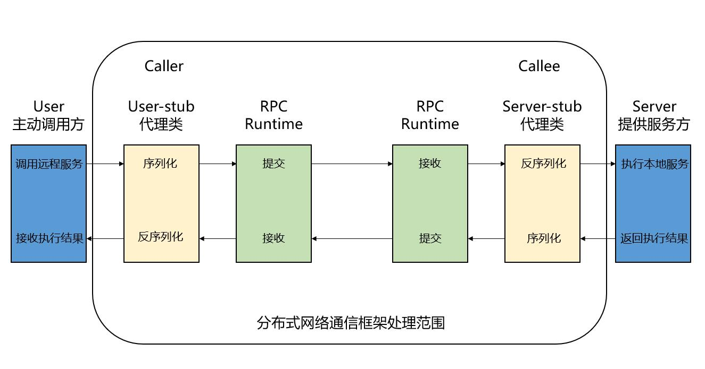
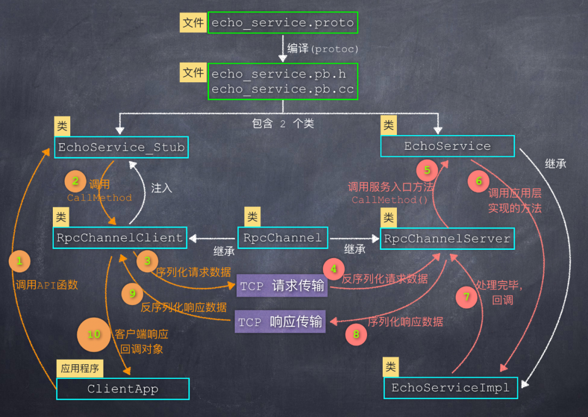

# 基于RPC的分布式TCP网络通信框架

## 0 主要技术栈和开发环境

（1）使用Muduo高性能网络库构建PRC服务提供端服务器；

（2）使用Protobuf进行数据的序列化和反序列化；

（3）使用ZooKeeper实现分布式一致性协调服务；

（4）使用json格式作为Zookeeper信息的配置文件；

（5）实现线程安全的异步日志模块；

（6）使用CMake构建项目，Git管理项目。

开发环境：Ubuntu 18.04  GCC版本：7.5.0

## 1 初识集群和分布式
### 1.1 单机服务器可能存在的问题
（1）受限于硬件资源，承受的用户并发量有限；

（2）任意模块的修改，整个项目将需要重新构建和部署；

（3）系统中各个模块对硬件资源的需求可能不一样，有的侧重CPU密集型而有的是I/O密集型。

### 1.2 集群

每台服务器独立运行一个项目的所有模块。

（1）优点：可以快速、显著地提升并发量。

（2）缺点：工程修改时需要整体构建和多次重新部署，且并不是项目中所有的模块都需要高并发。

### 1.3 分布式

一个工程拆分了很多模块，每个模块独立部署在一个服务器主机上，所有的服务器协同工作，共同提供服务。还可以根据节点的并发要求，对模块节点进行集群部署。

（1）优点：系统的可拓展性、可靠性、高容错性和灵活性都较高；

（2）潜在问题：各个模块之间怎样访问？如何调用其他主机进程上模块的业务方法？——引入RPC服务


## 2 MyRPC网络通信框架示意图


****


## 3 Protobuf

### 3.1 Protobuf简介

Protobuf是与json，XML功能相似的一种结构化数据格式，是一种google定义的结构化数据格式，用于在网络通讯间的数据序列化和反序列化，以用于网络传输。序列化：将数据结构或对象转换成二进制串的过程；反序列化：将在序列化过程中所生成的二进制串转换成数据结构或者对象的过程。

### 3.2 本项目为什么要用Protobuf

（1）相对于其他格式，Protobuf解析的速度快（即序列化反序列化速度快），占用空间小，以及兼容性好，很适合做数据存储或网络通讯间的数据传输；

（2）Protobuf不仅提供了消息结构，也提供了接口结构。通过Protobuf提供的机制，服务端与服务端之间只需要关注接口方法名（service）和参数（message）即可通信，而不需关注繁琐的链路协议和字段解析，极大降低了服务端的设计开发成本。

### 3.3 怎样使用

首先通信双方要约定好proto配置文件的内容，例如

```protobuf
syntax = "proto3";
package myproto;//相当于命名空间
option cc_generic_services = true;//要使用protobuf提供的接口机制，需要将此项打开

message ResultCode
{
    int32 errcode = 1;
    bytes errmsg = 2;
}

message LoginRequest
{
    bytes name = 1;
    bytes pwd = 2;
}

message LoginResponse
{
    ResultCode result = 1;
    bool success = 2;
}


message RegisterRequest
{
    uint32 id = 1;
    bytes name = 2;
    bytes pwd = 3;
}

message RegisterResponse
{
    ResultCode result = 1;
    bool success = 2;
}

service UserServiceRpc
{
    rpc Login_rpc(LoginRequest) returns(LoginResponse);
    rpc Register(RegisterRequest) returns(RegisterResponse);
}
```

使用protobuf提供的protoc工具，通过命令"protoc user.proto --cxx_out=./"会在当前目录下生成对应的.cc文件和.h文件，相当于对上面proto文件进行"编译"，得到C++的源文件和头文件。其中包含两个重要的类

```c++
//callee端的类，即远程方法执行端，RPC服务的提供者
class UserServiceRpc : public google::protobuf::Service
{
	virtual void Login(controller,const LoginRequest,LoginResponse,Closure done);//伪代码
	ServiceDescriptor* GetDescriptor();
}

//caller端的类，即想调用远程方法的这一端，RPC服务的消费者	
class UserServiceRpc_Stub : public UserServiceRpc
{
	void Login(...);//伪代码
	channel_;//伪代码
}

```

### 3.4 笔记还在整理

